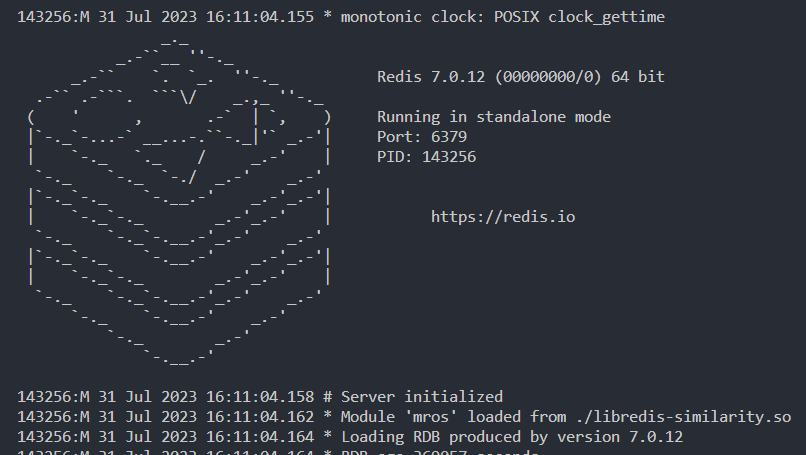
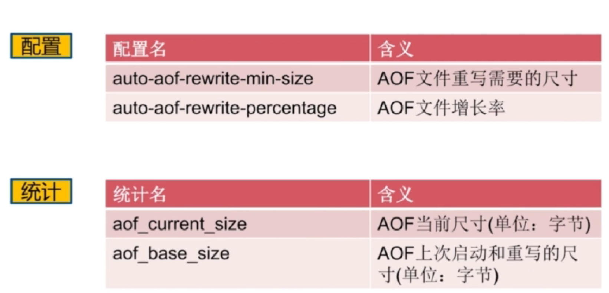

# load mros module to redis

## load

```bash
cd src
rm -rf build/
mkdir build
cd build
cmake ..
make

#启动时加载模块
redis-server --loadmodule ./libredis-similarity.so
# 查看加载模块
MODULE LIST
```

```bash
#运行时加载模块
redis-cli
MODULE LOAD /path/to/libredis-similarity.so
```

加载成功时redis会提示：



# MROS Command

## `mros.reserve`

- 在redis中创建一个mros结构，用法如下，MAX_Capacity为期望插入的元素的数目，注意只有MAX_CAPACITY相同的mros结构才可以merge求相似度
- **return:** ok or error message

```bash
mros.reserve <KEY> <MAX_CAPACITY (uint)>
```


## `mros.add`

- 插入一个元素，用法如下，如果没有找到对应的key，会自动新建一个mros结构，并插入元素
- **return:** 0表示插入成功，1表示插入失败

```bash
MROS.ADD <KEY> ITEM
```


## `mros.madd`

- 插入一个或多个元素
- **return:** 一个数组，表示对应元素是否插入成功。0表示插入成功，1表示插入失败


## `mros.insert`

- 使用`mros.add`或`mros.madd`命令添加元素，若之前没有创建过对应的mros结构，默认创建的mros结构所支持的最大元素数目为1千万
- 如果需要维护更多的元素，可以使用`mros.reserve`创建或者`mros.insert`命令，它们可以指定创建的mros结构需要支持的最大元素数目。用法如下：

```bash
mros.insert {mros_key} [CAPACITY {max_capacity} ITEMS {item1 item2 ...}]
```

- **return:** array or error message


## `mros.jaccard`

- 该命令用来计算连个mros维护的集合元素的jaccard相似度
- key不存在时会报错

```bash
mros.jaccard <Key1> <Key2>
```

## `mros.info`


# RDB save and Load

- 注册时我们实现了mros rdb_load和rdb_save对应的函数,因此mros支持持久化存储和加载

```C
    static RedisModuleTypeMethods mrosTypeprocs = {
        .version = REDISMODULE_TYPE_METHOD_VERSION,
        .rdb_load = MROSRdbLoad,
        .rdb_save = MROSRdbSave,
        .aof_rewrite = MROSAofRewrite,
        .free = MROSFree,
        .mem_usage = MROSMemUsage};
```

```bash
# 同步持久化，阻塞命令
save

# 异步持久化，非阻塞命令
bgsave
```

# AOF rewrite

- 使用rdb进行持久化的方式为全量复制，可以使用AOF机制进行增量复制来降低加载的数据量，通过将每条写命令以日志的形式记录下来实现数据的持久化存储
- 除此之外，我们实现了AOF重写的函数，该函数可以避免写命令重复或过多造成AOF日志数据量过大的问题，它会将重复的日志合并、删除被覆盖的写命令等

```C
    static RedisModuleTypeMethods mrosTypeprocs = {
   ...
        .aof_rewrite = MROSAofRewrite,
   ...
};
```

```bash
# 异步aof重写机制
BGREWRITEAOF
```

## AOF重写相关配置

- 下面的配置可以控制在什么时候启动aof重写



-当面配置满足下列条件时，会自动触发aof重写


# Java-Client

[redission for MROS](https://github.com/Y-GD/redis-modules-java)
